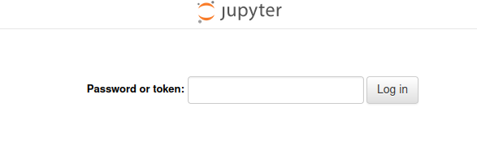

<h1>iris</h1>

This repository runs a containerized jupyter notebook that achieves 100%
classification accuracy on the
[iris dataset](https://archive.ics.uci.edu/dataset/53/iris) using XGBoost.  The
 steps to download the Docker container and run the notebook are below:

1. Pull the container image and run the container
```bash
docker pull seancooke/iris:latest
docker run -p 8888:8888 -d seancooke/iris:latest
```

3. Get the CONTAINER ID of the container with `IMAGE=seancooke/iris:latest`
```bash
docker ps
docker exec -it <CONTAINER_ID>  /bin/bash
```

3. Copy the hash between `?token=` and the next whitespace 
```bash
jupyter server list
```

4. Open port 8888 on your local machine, paste the hash into the 'Password or 
token:' field on the notebook server, and click 'Log in'



5. Once inside the jupyter notebook container, open `work/classification.ipynb`

6. Run all notebook cells by selecting `Kernel -> Restart Kernel and Run All
Cells...`
